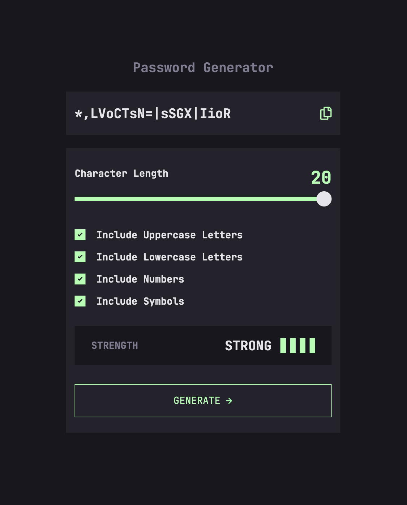
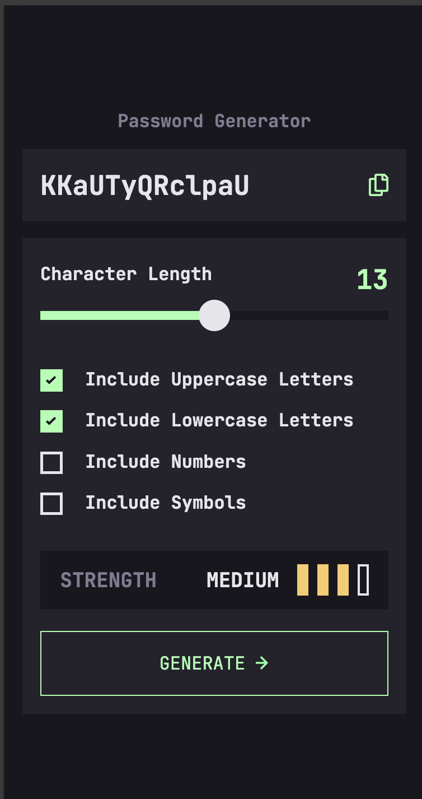
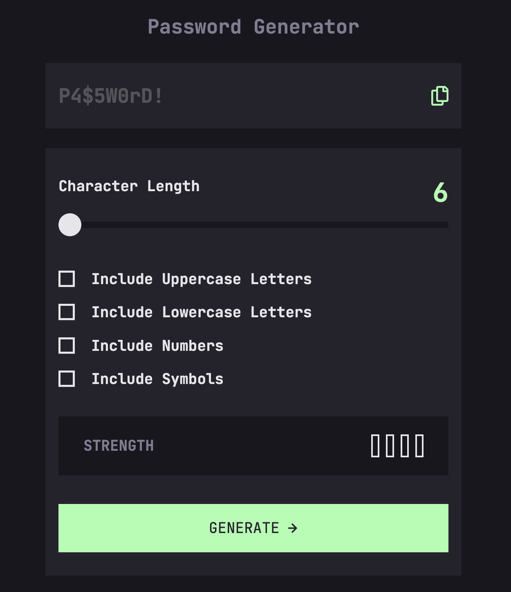

# Frontend Mentor - Password generator app solution

This is a solution to the [Password generator app challenge on Frontend Mentor](https://www.frontendmentor.io/challenges/password-generator-app-Mr8CLycqjh). Frontend Mentor challenges help you improve your coding skills by building realistic projects. 

## Table of contents

- [Overview](#overview)
  - [The challenge](#the-challenge)
  - [Screenshot](#screenshot)
  - [Links](#links)
- [My process](#my-process)
  - [Built with](#built-with)
  - [What I learned](#what-i-learned)
  - [Continued development](#continued-development)
  - [Useful resources](#useful-resources)
- [Author](#author)

## Overview

### The challenge

Users should be able to:

- Generate a password based on the selected inclusion options
- Copy the generated password to the computer's clipboard
- See a strength rating for their generated password
- View the optimal layout for the interface depending on their device's screen size
- See hover and focus states for all interactive elements on the page

### Screenshot





### Links

- Solution URL: [Github](https://github.com/mroungou/password-generator-app)
- Live Site URL: [Password Generator App](https://mroungou.github.io/password-generator-app/)

## My process

### Built with

- Semantic HTML5 markup
- CSS custom properties
- Flexbox
- CSS Grid
- Mobile-first workflow

### What I learned

I learned about password entropy which is essentially how hard it would be for a person to crack your password depending on it's complexity i.e. length, characters etc.


```js
const passwordStrength = (userPassword, poolSize) => {
    const bitSize = userPassword.length * Math.log2(poolSize) //bit size calcs

    const strengthText = document.getElementById('text')
    
    strengthText.innerText = 
        bitSize > 120 ? 'strong' :
        bitSize > 60 ? 'medium' :
        bitSize > 36 ? 'weak' : 'too weak!'

    if (bitSize > 120) {
        updateStrengthIndicator(4)
    } else if (bitSize > 60) {
        updateStrengthIndicator(3)
    } else if (bitSize > 36) {
       updateStrengthIndicator(2)
    } else {
        updateStrengthIndicator(1)
    }
}
```

### Continued development

Would defintely like to improve the logic of the password generation and improvement in security. For real-world applications crypto.getRandomValues() is used for crytographic purposes. I would like to implement this in the near future.

### Useful resources

- [Creating custom checkboxes](https://moderncss.dev/pure-css-custom-checkbox-style/) - 
- [Custom Slider](https://www.w3schools.com/howto/howto_js_rangeslider.asp) -
- [Custom Slider](https://blog.logrocket.com/creating-custom-css-range-slider-javascript-upgrades/) - 
- [Password Entropy](https://www.omnicalculator.com/other/password-entropy)

## Author

- Twitter - [@mroungou](https://x.com/mroungou)

